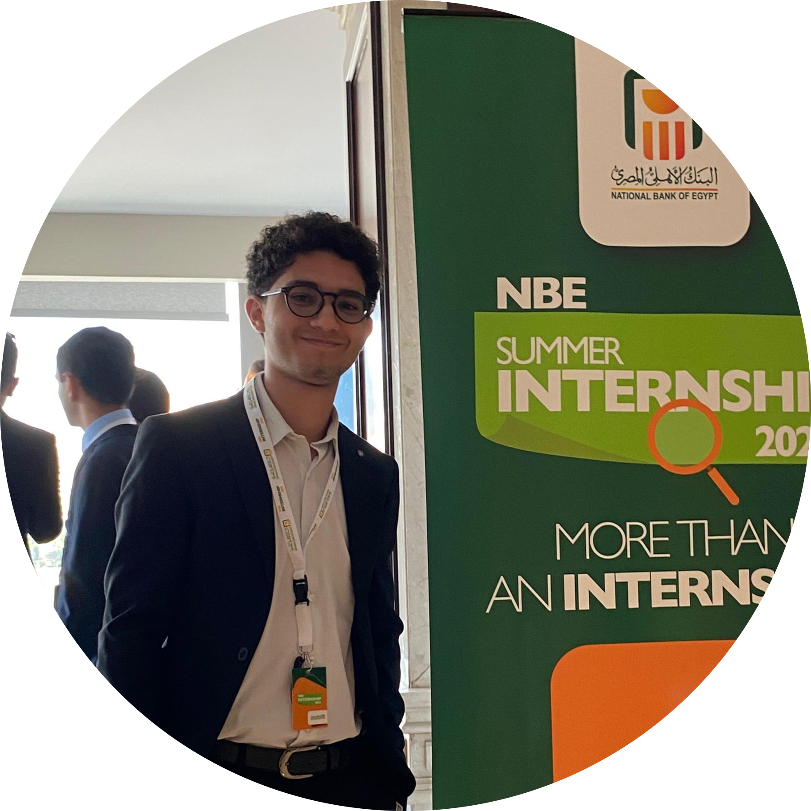

# 👋 Hi, I'm Mohamed Mostafa Ali

  

 <h3 align="center"><strong>🎓 Cybersecurity Enthusiast & Computer Science Student</strong></h3>

- I'm an undergraduate student pursuing a **Bachelor of Computer Science** with a major in **Cybersecurity** at the **Arab Academy for Science, Technology & Maritime Transport**. With a GPA of **3.54/4.0 (Excellent)**, I'm passionate about securing systems, analyzing threats, and building tools to enhance cybersecurity.

---

### 🛠️ Technical Skills & Expertise

- **Cybersecurity**: SOC operations, threat modeling, malware analysis, and incident response.
- **Networking**: Advanced knowledge of network security and protocols (CCNA certified).
- **Scripting & Automation**: Proficient in Python, Bash, and PowerShell for automating security tasks.
- **Operating Systems**: Highly skilled in Linux and Windows system management.
- **Cloud & DevOps**: Experience with Azure, Terraform, and Docker for cloud-based projects.
- **Programming**: Strong foundation in C, C++, Java, and OOP concepts.

---

### 🚀 Projects

- Check out my repositories to see my projects! From **malware analysis** to **cloud-based red teaming labs**, I've worked on a variety of cybersecurity and system monitoring tools.  
👉 [GitHub Repos](https://github.com/MohamedMostafa010?tab=repositories)

---

### 📚 Courses, Certifications, and Diplomas

- Here are some of the courses and certifications I've completed:

  - **AMIT Learning SOC Diploma**
  - **CCNA 200-301**
  - **CCNA Network Security**
  - **Cisco CyberOps**
  - **MCSA (Active Directory Part)**
  - **Red Hat System Administration Level 1**
  - **CompTIA Linux+ XK0-005**
  - **(ISC)² Certified in Cybersecurity (CC)**
  - **CompTIA Security+ SY0-601**
  - **Junior Penetration Tester (eJPTv1)**
  - **Microsoft Certified: Azure Fundamentals (AZ-900)**
  - **TryHackMe Learning Paths**: Complete Beginner, Introduction to Cyber Security, Pre Security, and Cyber Security 101
  - **Microsoft Certified: Azure Fundamentals AZ-900**
  - **Certified Incident Responder (eCIR)**

---

### 🏆 Achievements

- **AMIT SOC Diploma Final Project**: Scored 100% in the final project.
- **TryHackMe Ranking**: Ranked in the **top 2% worldwide** on TryHackMe.
- **Certifications**: CCNA, CompTIA Security+, (ISC)² CC, eJPT, and more.

---

### 🌱 Learning & Growth

- I'm a proactive learner, always exploring new technologies and methodologies. I enjoy reading books like **"Bash Idioms"** to deepen my scripting skills and staying up-to-date with the latest cybersecurity trends.

---

### 🌐 Connect with Me

- **GitHub**: [MohamedMostafa010](https://github.com/MohamedMostafa010)
- **LinkedIn**: [Mohamed Mostafa Ali](https://www.linkedin.com/in/mohamedmostafaali)
- **Personal Website**: [Mohamed Mostafa Ali | Personal Website](https://mohamedmostafa010.github.io/)
- **Email**: mohamedmostafa10110@gmail.com

---

### 💬 Let's Collaborate!

- I'm always open to new opportunities, collaborations, or discussions about cybersecurity, scripting, or cloud technologies. Feel free to reach out! 😊
