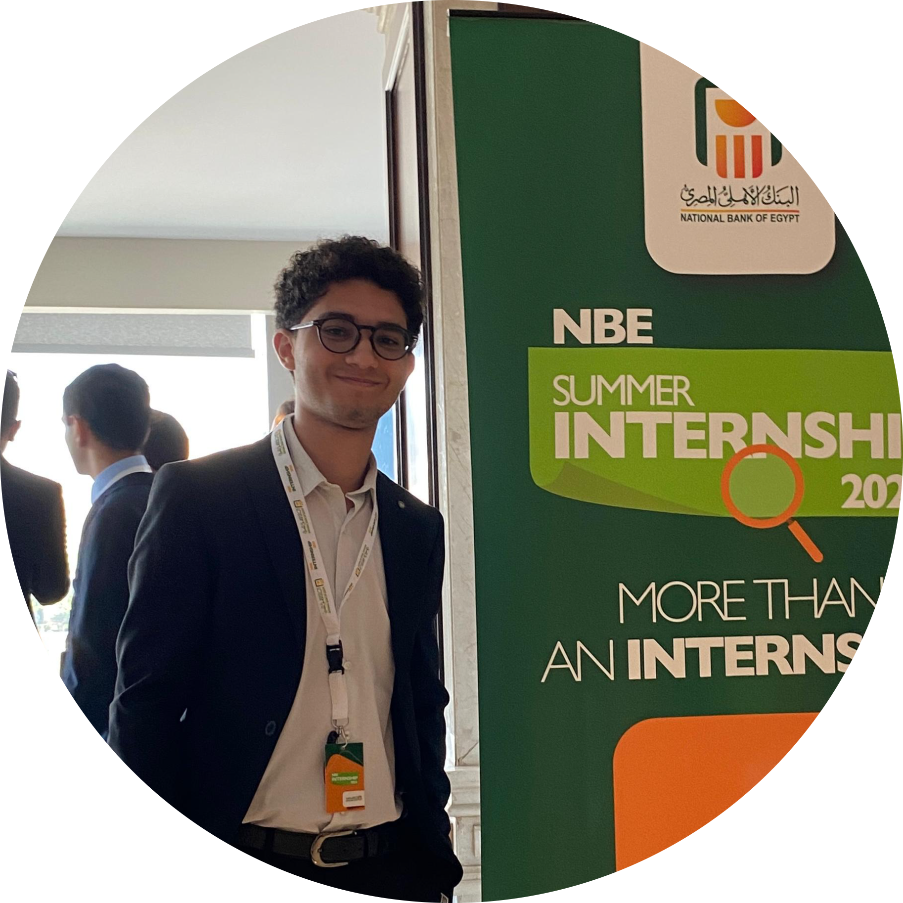
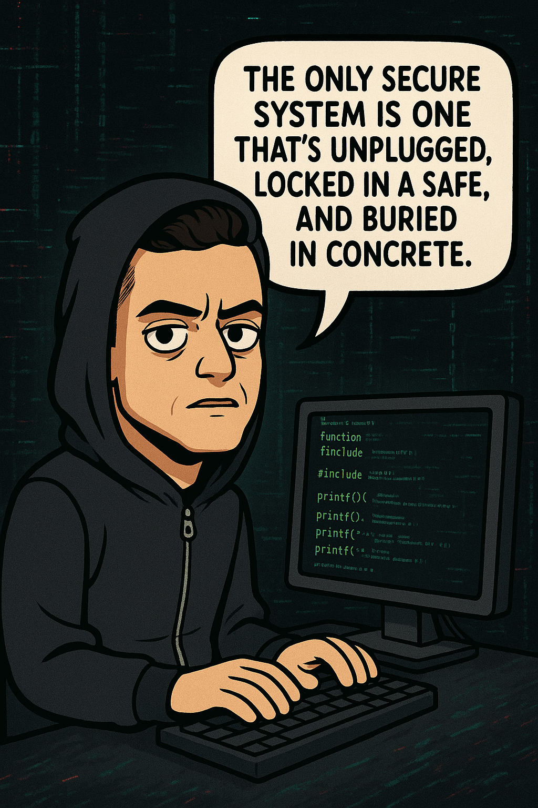

# 👋 Hi, I'm Mohamed Mostafa Ali

  

<h3 align="center"><strong>🎓 Cybersecurity Enthusiast & Computer Science Student</strong></h3>

- I'm an undergraduate student pursuing a **Bachelor of Computer Science** with a major in **Cybersecurity** at the **Arab Academy for Science, Technology & Maritime Transport**. With a GPA of **3.56/4.0 (Excellent)**, I'm passionate about securing systems, analyzing threats, and building tools to enhance cybersecurity.

---

### 🛠️ Technical Skills & Expertise

- **Cybersecurity**: SOC operations, threat modeling, malware analysis, and incident response.
- **Networking**: Advanced knowledge of network security and protocols (CCNA certified).
- **Scripting & Automation**: Proficient in Python, Bash, and PowerShell for automating security tasks.
- **Operating Systems**: Highly skilled in Linux and Windows system management.
- **Cloud & DevOps**: Experience with Azure, Terraform, and Docker for cloud-based projects.
- **Programming**: Strong foundation in C, C++, Java, and OOP concepts.

---

### 🚀 Projects

- Check out my repositories to see my projects! From **malware analysis** to **cloud-based red teaming labs**, I've worked on a variety of cybersecurity and system monitoring tools.  
👉 [GitHub Repos](https://github.com/MohamedMostafa010?tab=repositories)

---

### 📚 Courses, Certifications, and Diplomas

- Here are some of the courses and certifications I've completed:

  - **AMIT Learning SOC Diploma**
  - **CCNA 200-301**
  - **CCNA Network Security**
  - **Cisco CyberOps**
  - **MCSA (Active Directory Part)**
  - **Red Hat System Administration Level 1**
  - **CompTIA Linux+ XK0-005**
  - **(ISC)² Certified in Cybersecurity (CC)**
  - **CompTIA Security+ SY0-601**
  - **Junior Penetration Tester (eJPTv1)**
  - **Microsoft Certified: Azure Fundamentals (AZ-900)**
  - **TryHackMe Learning Paths**: Complete Beginner, Introduction to Cyber Security, Pre Security, and Cyber Security 101
  - **Certified Incident Responder (eCIR)**

---

### 🏆 Achievements

- **AMIT SOC Diploma Final Project**: Scored 100% in the final project.
- **TryHackMe Ranking**: Ranked in the **top 2% worldwide** on TryHackMe.
- **Certifications**: CCNA, CompTIA Security+, (ISC)² CC, eJPT, and more.

---

### 🌱 Learning & Growth

- I'm a proactive learner, always exploring new technologies and methodologies. I enjoy reading books like **"Bash Idioms"** to deepen my scripting skills and staying up-to-date with the latest cybersecurity trends.

---

### 🌐 Connect with Me — *Click the badges to explore and interact with my work*

 

   
  

---

### ✍️ Latest from My Blog

I write about cybersecurity concepts, walkthroughs, and my learning journey on Medium. Check out my latest posts:

  

- [**Buffer Overflow Attack Lab: A Hands-On Journey Through Software Security**](https://medium.com/@mohamedmostafa10110/buffer-overflow-attack-lab-a-hands-on-journey-through-software-security-1403d055267c) - Comprehensive walkthrough of buffer overflow exploits, reverse shells, and bypassing ASLR & StackGuard mitigations.

- [**Hands-On Memory Forensics: A DFIR Investigation of a Compromised Windows XP Machine**](https://medium.com/@mohamedmostafa10110/hands-on-memory-forensics-a-dfir-investigation-of-a-compromised-windows-xp-machine-ed8a6ea7993c) - Using Volatility2 to identify malicious processes, injected DLLs, C2 communications, and phishing URLs targeting financial institutions.

- [**Malware Analysis and Reverse Engineering Report: A Hands-On Journey Through Macro Malware Dissection**](https://medium.com/@mohamedmostafa10110/malware-analysis-and-reverse-engineering-report-a-hands-on-journey-through-macro-malware-eb95fde9f8de) - Comprehensive dissection of macro-based malware: from static analysis to dynamic execution and threat intelligence validation.

👉 **[Read all my articles on Medium](https://medium.com/@mohamedmostafa10110)**

### 🧠 Philosophy & Mindset

 
   
  
<em>"Perfect security is a myth; constant vigilance is not."</em>
 

### 💬 Let's Collaborate!

- I'm always open to new opportunities, collaborations, or discussions about cybersecurity, scripting, or cloud technologies. Feel free to reach out! 😊

---

### 📄 License & Reuse

- Feel free to use this README template for your own profile!  
- You can copy, modify, and use it however you'd like.
---

